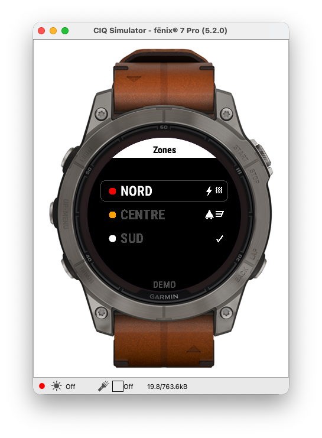
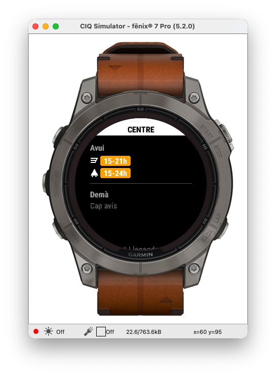
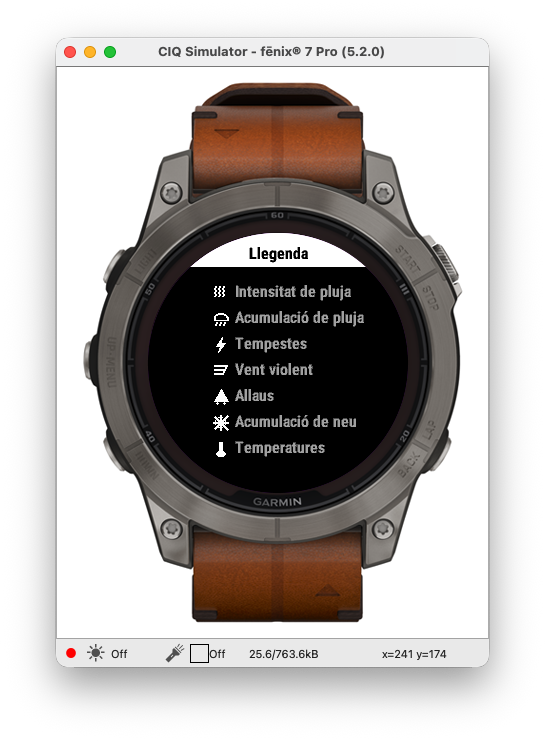

# Alertes Andorra

A Garmin Connect IQ widget for Fenix 7 series watches that displays real-time weather alerts for Andorra, fetched from [meteo.ad](https://www.meteo.ad/Alertes).

## Features

- Fetches live weather alert data from `meteo.ad` over BLE
- Displays alerts for three geographic zones: **Nord**, **Centre**, **Sud**
- Per-alert-type icons for quick identification
- Scrollable detail view per zone with time-slot breakdown (today and tomorrow)
- Severity colour coding: yellow (Groc), orange (Taronja), red (Vermell)
- Legend view explaining each alert type icon
- Loading splash screen and tick icon when a zone has no active alerts
- Falls back to mock data in the simulator (no network required)

## Alert Types

| Icon | Type |
|------|------|
| icon_type1 | Intensitat de pluja |
| icon_type2 | Acumulació de pluja |
| icon_type3 | Tempestes |
| icon_type4 | Vent violent |
| icon_type5 | Allaus |
| icon_type6 | Acumulació de neu |
| icon_type7 | Temperatures |

## Severity Levels

| Colour | Meaning |
|--------|---------|
| White  | Cap avís (no alert) |
| Yellow `#FFDB23` | Groc |
| Orange `#FF8C00` | Taronja |
| Red `#DD2222`    | Vermell |

## Supported Devices

- Fenix 7 / 7S / 7X
- Fenix 7 Pro / 7S Pro / 7X Pro / 7X Pro No Wifi

## Requirements

- Garmin Connect IQ SDK 8.4.1+
- VS Code with the [Monkey C extension](https://marketplace.visualstudio.com/items?itemName=garmin.monkey-c)

## Building

Open the `AndorraAlerts` folder in VS Code and run **Run App** from the Run & Debug panel, or build from the command line:

```bash
$ monkeyc \
  -o bin/GarminAlertesAndorra.prg \
  -f monkey.jungle \
  -y <developer_key> \
  -d fenix7pro
```

## Project Structure

```shell
AndorraAlerts/
├── manifest.xml                  # App manifest (entry point, permissions, devices)
├── monkey.jungle                 # Build config
├── source/
│   ├── AlertesAndorraApp.mc      # App entry point
│   ├── AlertesAndorraView.mc     # Main zone list view + HTTP parsing
│   ├── AlertesDelegate.mc        # Input handling for main view
│   ├── ZoneDetailView.mc         # Scrollable per-zone detail view
│   ├── ZoneDetailDelegate.mc     # Input handling for detail view
│   ├── LegendView.mc             # Alert type legend view
│   └── LegendDelegate.mc         # Input handling for legend
└── resources/
    ├── drawables/                # Launcher icon, splash, alert type icons
    ├── layouts/
    └── strings/
```

## Navigation

| Action | Result |
|--------|--------|
| UP / DOWN | Move selection between Nord / Centre / Sud |
| SELECT | Open zone detail |
| BACK | Return to previous screen |
| UP / DOWN (detail) | Scroll content |
| SELECT (detail) | Open alert type legend |

## Screenshots 





